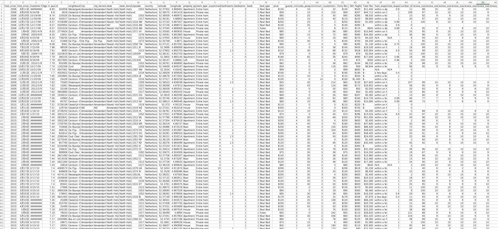

\newpage
\tableofcontents
```{r setup, include=FALSE}
knitr::opts_chunk$set(echo = TRUE)
rm(list=ls())
 

necessary_packages <- c("dplyr", "ggplot2", "gridExtra"
                        ,"kableExtra","stringr","patchwork"
                        ,"car","caret","ROCR","knitr","broom","kableExtra","readr")

#Generate BibTeX entries for the packages
knitr::write_bib(necessary_packages, file = "packages.bib")
# Combine two .bib files into one
bib_files <- c("packages.bib", "references.bib")
combined_bib <- "reference_list.bib"

# Read and combine the content of both .bib files
bib_content <- unlist(lapply(bib_files, readLines))
writeLines(bib_content, combined_bib)


#Install packages 
for (pkg in necessary_packages) {
  if (!requireNamespace(pkg, quietly = TRUE)) {
    install.packages(pkg)
  } 
}

#lapply library
lapply(necessary_packages, library, character.only = TRUE)
   
```

\newpage

# Dataset

## Introduction
 
Airbnb, as a prominent product of the sharing economy, has indeed seen rapid growth in recent years, providing a unique alternative to traditional hotel accommodations with a wide range of short-term and long-term lodging options. Various studies have delved into different aspects of Airbnb, particularly focusing on the factors that influence customer satisfaction and ratings [@customer1]. One key area of research has been the impact of factors such as listing functionality, host attributes, customer reviews, and market conditions on guest satisfaction. These studies aim to understand how these elements collectively shape the overall experience of guests, ultimately influencing their review scores and the likelihood of them returning [@customer2]. For example, the quality of service provided by hosts, the amenities offered, and the location of the accommodation all play crucial roles in determining guest satisfaction levels [@customer3]. Moreover, research has also highlighted the significance of rental policies, listing reputation, and location in influencing guest satisfaction levels. Factors such as the clarity of rental policies, the reputation of the listing, and the convenience of the location can greatly impact how satisfied guests are with their overall experience [@customer4]. By examining these various factors that contribute to customer satisfaction in the context of Airbnb, researchers aim to provide valuable insights for hosts and practitioners to enhance the overall guest experience and increase customer satisfaction levels [@customer1].

In this project, we aim to extend this body of research by focusing on the factors influencing property ratings and guest satisfaction on Airbnb. Specifically, we will explore the relationship between high ratings  (scores greater than or equal to 95) and various predictors, including price, regional average price, number of bedrooms, number of bathrooms, host response rate, and room type. By building suitable models, we seek to uncover the determinants of high ratings and provide actionable insights for property owners. Additionally, we will analyze how these factors can be adjusted to optimize guest satisfaction and improve overall ratings, thereby enhancing the competitive edge of Airbnb listings.

## Dataset Description

### Source
The dataset to be analyzed is collected from https://data.world/cannata/gaairbnb and is named "AirBNB.csv". 

### File Type
Dataset file type: CSV

### List of variables (description and type) 

In the raw dataset, there are 7833 observations on 41 variables. 
As shown in Table 1, the dataset contains the following variables:

```{r variables-table, echo=FALSE, message=FALSE}

# Create a data frame of the variables with Airbnb data types
variables <- data.frame(
  Variable = c("host_id", "host_name", "host_since_year", "host_since_anniversary", 
               "Customer Since", "Age in years", "id", "neighbourhood_cleansed", 
               "city", "city_translated", "state", "state_translated", 
               "zipcode",                "country", "latitude", "longitude", 
               "property_type", "room_type",                "accommodates", "bathrooms", 
               "bedrooms", "beds", "bed_type", "price", 
               "guests_included", "extra_people", "minimum_nights", "customers @ 50% review rate", 
               "Daily Rev per 2 guests, unless limited to 1",  "Min Nights", "Total Rev", "host_response_time", 
               "host_response_rate",                "number_of_reviews", "review_scores_rating", "review_scores_accuracy", 
               "review_scores _cleanliness", "review_scores_checkin",                "review_scores _communication", "review_scores_location", 
               "review_scores_value"),
  DataType = c("integer", "character", "integer", "date", 
               "integer", "integer", "integer", "character", 
               "character", "character", "character", "character", 
               "character",                "character", "numeric", "numeric",
               "character", "character",                "integer", "integer",
               "integer", "integer", "character", "numeric", 
               "integer", "numeric", "integer",                "integer", 
               "numeric",                "integer", "numeric", "character", 
               "numeric",                "integer", "integer", "integer", 
               "integer", "integer",                "integer", "integer", "integer"),
  Description = c("Unique identifier for the host", "Name of the host", "Year when the host started",  "Anniversary date of the host's start",
                  "Duration since the customer has been with Airbnb", "Age of the listing in years", "Unique identifier for the listing",                   "Specific neighborhood of the listing", 
                  "City where the listing is located","Translated city name", "State where the listing is located", "Translated state name", 
                  "Zip code of the listing location",   "Country of the listing", "Latitude coordinate of the listing", "Longitude coordinate of the listing", 
                  "Type of property (e.g., apartment, house)",
                  "Type of room (e.g., entire home/apt, private room)", 
                  "Number of guests the listing accommodates", "Number of bathrooms", 
                  "Number of bedrooms", "Number of beds", "Type of bed (e.g., real bed, futon)", 
                  "Price per night", "Number of guests included in the price", 
                  "Cost for additional guests", "Minimum number of nights required to book", 
                  "Number of customers at a 50% review rate", "Daily revenue per 2 guests", 
                  "Minimum nights required", "Total revenue generated", 
                  "Time taken by the host to respond", "Response rate of the host", 
                  "Total number of reviews received", "Overall rating score from reviews", 
                  "Accuracy rating score from reviews", "Cleanliness rating score from reviews", 
                  "Check-in rating score from reviews", "Communication rating score from reviews", 
                  "Location rating score from reviews", "Value rating score from reviews")
)

# Display the data frame as a table with horizontal lines

variables %>%
  kable(caption = "List of Variables in the Airbnb Dataset", booktabs = TRUE) %>%
  kable_styling(full_width = FALSE) %>%
  row_spec(0, bold = TRUE) %>%
  column_spec(1, width = "4cm") %>%  # Adjust the width of the first column
  column_spec(2, width = "2cm") %>%  # Adjust the width of the second column
  row_spec(1:nrow(variables), hline_after = TRUE)
```


### Raw Dataset Screenshot


```{r screenshot, echo=FALSE, fig.cap="Raw Dataset Screenshot", out.width = '100%', fig.align='center'}

```


### Type of Data Cleaning Expected
 
The variables selected for analysis are `price`, `accommodates`, `bathrooms`, `bedrooms`, `room_type`, `host_response_rate`, and `review_scores_rating`.

#### Data Wrangling Steps


We propose the following data wrangling steps:

1. **Filtering Observations** :
   * Filter out observations related to property_type "apartment".
   * Select the necessary variables for analysis.
2. **Handling Missing Values** :
   * Identify and handle missing values appropriately. This may include removing rows with significant missing data or imputing missing values using appropriate methods.
3. **Data Type Conversion** :
   * Ensure all columns are of the correct data type. Convert columns to appropriate types (e.g., numeric, factor, date) as necessary.
4. **Removing Duplicates** :
   * Check for and remove any duplicate rows to ensure each observation is unique. 
5. **Outlier Detection and Treatment** :
   * Identify and treat outliers that may skew the analysis. This can involve removing extreme values or transforming them.
6. **Creating New Features** :
   * Create new features that may be useful for analysis, such as calculating the age of the listing from the `host_since_year` variable. 
7. **Encoding Categorical Variables** :
   * Encode categorical variables (e.g., room_type) using techniques such as one-hot encoding or label encoding to make them suitable for analysis and modeling.

These steps will help ensure that the dataset is clean, consistent, and ready for further analysis and modeling.

\newpage

## Three proposed research questions
 
### Research question 1

Do properties with prices at different levels relative to the regional average price have significantly different ratings?


**1. Variables Considered:**

* **Price:** The nightly rental price of the property.
* **Region Average Price:** The average price in the region where the property is located.
* **Review Scores Rating:** The overall rating given by guests.

**2. Type of Analysis:**

* **Grouping:** Properties are divided into groups based on their price relative to the regional average price.
* **Descriptive Statistics:** Mean and standard deviation of review scores for each price group.
* **ANOVA:** To test for significant differences in review scores across the price groups.
* **T-Test:** To compare the review scores between two specific groups (below_avg and above_avg).
* **Visualization:** Box plot to visualize the distribution of review scores across price groups.

**3. Libraries and Required R Functions:**

* **dplyr:** For data manipulation and grouping.
* **ggplot2:** For creating visualizations.
* **stats:** For performing ANOVA and t-tests.
* **knitr:** For creating tables in the report.


### Research question 2
Can property ratings be predicted using price, regional average price, number of bedrooms , number of accommodates , and number of bathrooms ? Additionally, are the differences in ratings significant across different room types?

**1. Variables Considered:**

* **Price:** The nightly rental price of the property.
* **Region Average Price:** The average price in the region where the property is located.
* **Bedrooms:** The number of bedrooms in the property.
* **Accommodates:** The number of guests the property can accommodate.
* **Bathrooms:** The number of bathrooms in the property.
* **Room Type:** The type of room (e.g., entire home/apartment, private room, shared room).
* **Review Scores Rating:** The overall rating given by guests.

**2. Type of Analysis:**

* **Linear Regression:** To model the relationship between the review scores rating and the predictor variables.
* **Residual Analysis:** To assess the fit of the linear regression model by examining the residuals.
* **QQ Plot:** To check the normality of residuals, which is an assumption of linear regression.

**3. Libraries and Required R Functions:**

* **dplyr:** For data manipulation.
* **ggplot2:** For creating visualizations.
* **car:** For generating QQ plots.
* **stats:** For building and analyzing the linear regression model.
* **knitr:** For creating tables in the report.


### Research question 3
Can high ratings  (scores greater than or equal to 95) be predicted using price, regional average price, number of bedrooms, number of bathrooms, host response rate , and room type?

**1. Variables Considered:**

* **Price:** The nightly rental price of the property.
* **Region Average Price:** The average price in the region where the property is located.
* **Bedrooms:** The number of bedrooms in the property.
* **Bathrooms:** The number of bathrooms in the property.
* **Host Response Rate:** The rate at which the host responds to inquiries.
* **Room Type:** The type of room (e.g., entire home/apartment, private room, shared room).
* **High Rating (Binary):** Whether the property received a rating of 95 or higher (1 for high rating, 0 otherwise).

**2. Type of Analysis:**

* **Logistic Regression:** To model the relationship between the binary high rating variable and the predictor variables.
* **Confusion Matrix:** To evaluate the accuracy, sensitivity, and specificity of the logistic regression model.
* **ROC Curve and AUC:** To assess the model's ability to distinguish between high and low ratings.

**3. Libraries and Required R Functions:**

* **dplyr:** For data manipulation.
* **ggplot2:** For creating visualizations.
* **caret:** For generating confusion matrix and performance metrics.
* **ROCR:** For generating ROC curve and calculating AUC.
* **stats:** For building and analyzing the logistic regression model.
* **knitr:** For creating tables in the report.

\newpage
# Data Import and Cleaning 


This section will prepare a well-structured dataset for subsequent analytics containing three steps: import, cleaning, and tidying. 


## Data Import
Since the raw data is in CSV format, we use the function "read.csv" to import it. Then, we filter out the observations related to the property type "Apartment." 
```{r echo=TRUE, message=FALSE, warning=FALSE}
# import dataset and filter out apartment
tb<-read.csv("AirBnb.csv") %>%   filter(property_type=="Apartment")
names(tb)
```

## Cleaning

### Tidying the variable names
Tidying variable names ensures consistency and clarity, making data more accessible to manipulate and analyze. For instance, columns like “customers @ 50% review rate” become “customers_50_review_rate”, “Daily Rev per 2 guests, unless limited to 1” becomes “daily_rev_per_2_guests”, and “Min Nights” becomes “min_nights”, improving overall data quality.

```{r}
# Clean variable names
clean_names <- function(names) {
  names %>%
    tolower() %>%
    str_replace_all(" ", "_") %>%
    str_replace_all("[^[:alnum:]_]", "")
}

colnames(tb) <- clean_names(colnames(tb))

```


### Select variables


Although our dataset includes many columns, we have selected a subset for analysis based on the following reasons:

**Variables Selected for Analysis:**

* **Price:** The nightly rental price of the property.
* **Regional Average Price:** The average price in the region where the property is located.
* **Number of Bedrooms:** The number of bedrooms in the property.
* **Number of Bathrooms:** The number of bathrooms in the property.
* **Host Response Rate:** The rate at which the host responds to inquiries.
* **Room Type:** The type of room (e.g., entire home/apartment, private room, shared room).

**Reasons for Selection:**

1. **Objective Limitations:** Variables related to location (e.g., latitude, longitude, neighbourhood) would require more detailed information about transportation, local amenities, population density, and city layout to be accurately analyzed.
2. **Complexity:** This experiment focuses on learning statistical methods using R. It is not intended to be a comprehensive analysis but rather an attempt to explore the impact of a few common variables on property ratings.
3. **Future Scope:** More data types and sophisticated analysis methods can be considered in future studies to provide a more in-depth and comprehensive analysis.


```{r}
# select the necessary variables
tb.selected<-tb %>% 
  select(price,accommodates,bathrooms,bedrooms,room_type,
                host_response_rate,review_scores_rating,neighbourhood_cleansed)

str(head(tb.selected,1))
 

``` 
### Remove Duplicate Rows

Removing duplicate rows is crucial in R statistics to ensure data accuracy. Duplicate entries can skew analysis and lead to incorrect results. For instance, having multiple identical listings would distort average price calculations and other statistical metrics, leading to misleading conclusions.

```{r}  
# Remove duplicate rows
tb.selected <- unique(tb.selected)

```

### Renaming variables  
Renaming variables is crucial in data processing, enhancing readability and ensuring consistency throughout the dataset. Giving columns meaningful names makes the data easier to understand and work with. For instance, renaming "neighbourhood_cleansed" to a more intuitive name like "region" clarifies its meaning. This improved clarity is instrumental when performing calculations such as datermining the region's average price, ensuring accurate and efficient analysis.
```{r} 
tb.selected <- tb.selected %>%
  rename(region = neighbourhood_cleansed)

```


### Data type conversion

Data type conversion is essential in data processing, ensuring that each variable is in the appropriate format for analysis. Converting data types helps prevent errors and allows statistical and computational methods to be applied correctly. Given a view of the selected variables, we found that some variables are in the wrong type. For example, the variable "price" and "host_response_rate" should be numerical but were in character type. Converting these to numeric types allows for accurate calculations and meaningful analysis, such as determining average prices and response rates.
```{r warning=FALSE}
# change the type of some variables 
tb.selected$price<-parse_number(tb.selected$price)
tb.selected$host_response_rate<-as.numeric(tb.selected$host_response_rate)
```

### Handling missing values
Handling missing values is a critical step in data processing, as it ensures the integrity and reliability of the dataset. If not properly addressed, missing values can skew results and lead to incorrect conclusions. Since the sample size is large, we will remove observations with missing values from any column. 
```{r}
# remove the observations having missing values
tb.clean<-tb.selected %>% na.omit()
 
```

### Handling invalid data
The provided boxplots visually identify outliers and invalid data points across four variables: price, accommodation, bathrooms, and bedrooms. Significant outliers in the price and accommodated variables indicate potential data entry errors or anomalies. For instance, extremely high prices or unusually high accommodated values may need further investigation and possible removal to maintain data integrity.

Since the sample size is large, we are going to remove the observations with invalid data in any column.  

```{r echo=FALSE, message=FALSE, warning=FALSE}

# Display boxplots for each relevant variable to identify outliers
variables <- c("price", "accommodates", "bathrooms", "bedrooms")

# Create plots for each variable
plot_list <- lapply(variables, function(var) {
  ggplot(tb.clean, aes_string(x = "factor(1)", y = var)) + 
    geom_boxplot() +
    labs(title = paste("Boxplot of", var), x = "", y = var) +
    theme(axis.text.x = element_blank(), 
          axis.ticks.x = element_blank(), 
          plot.title = element_text(hjust = 0.5))
})

# Combine all plots into one plot using patchwork
combined_plot <- wrap_plots(plot_list) + plot_layout(ncol = 2)

# Print combined plot
print(combined_plot)


# Handle invalid data
tb.clean <- tb.clean %>%
  filter(price > 0, accommodates > 0, accommodates < 12, bathrooms >= 0, bedrooms > 0)


```


### Handle Outliers
This section focuses on handling outliers to ensure the dataset's accuracy and reliability. Outliers can significantly distort statistical analyses and lead to misleading conclusions. Specifically, we address outliers in the "price" variable using the interquartile range (IQR) method. This approach identifies and removes extreme values that fall outside 1.5 times the IQR from the first (Q1) and third quartiles (Q3). 
```{r} 
# Handle outliers (e.g., remove outliers in price)
Q1 <- quantile(tb.clean$price, 0.25)
Q3 <- quantile(tb.clean$price, 0.75)
IQR <- Q3 - Q1

tb.clean <- tb.clean %>%
  filter(price >= (Q1 - 1.5 * IQR) & price <= (Q3 + 1.5 * IQR))
 
 
```

 
 
### Generate New Features & Delete Useless Columns

This section focuses on generating new features and deleting unnecessary columns to enhance our dataset's usefulness and efficiency. Creating new features can provide additional insights and improve the performance of predictive models. For instance, By calculating region_average_price, we provide a valuable feature that summarizes regional price trends, aiding in more insightful analyses. Removing the region column helps streamline the dataset, focusing on the most relevant features for subsequent analyses.

```{r}
# Example: Calculate average price by region
 
tb.clean <- tb.clean %>%
  group_by(region) %>%
  mutate(region_average_price = mean(price, na.rm = TRUE)) %>%
  ungroup()


tb.clean <- tb.clean %>% select(-region)
 
```


### Handle Factor Columns

Factors in R represent categorical data, either nominal (no order) or ordinal (ordered). Converting variables to factors allows for efficient handling, accurate statistical modeling, and better results. For example, converting `room_type` to a factor ensures models handle different room types appropriately. Factors also aid in data summarization by categories and improve the clarity of data visualization.

```{r}
# Convert categorical variables to factor type
tb.clean <- tb.clean %>%
  mutate(across(c(room_type), as.factor))
```


## Tidying

Ensuring the data follows the three rules of “Tidy Data” is essential for effective data analysis. The three rules are: each variable forms a column, each observation forms a row, and each type of observational unit forms a table. The provided dataset adheres to these principles.

**Observation:**
The table displays various variables: price, accommodates, bathrooms, bedrooms, room_type, host_response_rate, review_scores_rating, and region_average_price. Each variable forms a distinct column, ensuring that the data is well-organized and easy to interpret.

**Structure:**

* **Columns (Variables):** Each column represents a single variable. For example, "price" indicates the listing price, "accommodates" shows the number of people it can host, "bathrooms" and "bedrooms" count these facilities, "room_type" describes the type of room, "host_response_rate" provides the response rate of the host, "review_scores_rating" shows the review rating, and "region_average_price" gives the average price in the region.
* **Rows (Observations):** Each row represents an individual Airbnb listing, providing all relevant details in a single, unified format.
* **Table (Observational Unit):** The table represents a single observational unit, which in this case, is the Airbnb listing.
  
```{r echo=FALSE, message=FALSE}
  
tb_head <- head(tb.clean)


#kable(tb_head, format="latex", booktabs=TRUE) %>% 
#  kable_styling(latex_options="scale_down")

# Split the dataframe into two parts
tb_part1 <- tb_head[,1:5 ]
tb_part2 <- tb_head[,6:8 ]

# Display first part of the table
kable(tb_part1, format = "latex", booktabs = TRUE, longtable = TRUE) %>%
  kable_styling(latex_options = c("hold_position")) %>%
  column_spec(1, bold = TRUE) %>%
  row_spec(0, bold = TRUE)
 
# Display second part of the table
kable(tb_part2, format = "latex", booktabs = TRUE, longtable = TRUE) %>%
  kable_styling(latex_options = c("hold_position")) %>%
  column_spec(1, bold = TRUE) %>%
  row_spec(0, bold = TRUE)
 
```

## Summary

The summary provides insights into the dataset after  data processing steps, and it generally aligns with our expectations:

1. **Price:** The price range is reasonable and reflects a variety of listings from budget to premium. The mean and median are close, indicating a relatively symmetrical distribution after removing outliers.
2. **Accommodates:** The range of accommodates values shows a variety of listings suitable for different group sizes, with a typical listing accommodating around 2-3 people.
3. **Bathrooms and Bedrooms:** The data shows typical values for bathrooms and bedrooms, with most listings having 1-2 of each. The presence of some listings with 0  bathrooms suggests possible studio apartments or shared spaces.
4. **Room Type:** The distribution indicates a higher number of entire homes/apartments, followed by private rooms, which is typical for Airbnb listings.
5. **Host Response Rate:** The high median and mean values indicate that most hosts are highly responsive.
6. **Review Scores Rating:** The high median and mean review scores suggest that the majority of the listings have good reviews.
7. **Region Average Price:** The region average price is consistent with our cleaned price data, showing a reasonable range and central tendency.

The statistics indicate that the data cleaning and preprocessing steps successfully prepared the data for further analysis, ensuring accuracy and reliability in subsequent analyses.


```{r echo=FALSE, message=FALSE}
#kable(summary(tb.clean))   
tb_head <-summary(tb.clean)

# Split the dataframe into two parts
tb_part1 <- tb_head[,1:5 ]
tb_part2 <- tb_head[,6:8 ]

# Display first part of the table
kable(tb_part1, format = "latex", booktabs = TRUE, longtable = TRUE) %>%
  kable_styling(latex_options = c("hold_position")) %>%
  column_spec(1, bold = TRUE) %>%
  row_spec(0, bold = TRUE)
 
# Display second part of the table
kable(tb_part2, format = "latex", booktabs = TRUE, longtable = TRUE) %>%
  kable_styling(latex_options = c("hold_position")) %>%
  column_spec(1, bold = TRUE) %>%
  row_spec(0, bold = TRUE)
```

\newpage
# Data Analysis

## Research question 1

**Do properties with prices at different levels relative to the regional average price have significantly different ratings?**

### Objective

To determine whether properties with prices at different levels relative to the regional average price have significantly different ratings. This analysis aims to explore if pricing strategy impacts customer satisfaction as reflected in review scores.

### Method

We divided the properties into groups based on their prices relative to the regional average price and then analyzed their review scores. The steps are as follows:

1. **Divide Prices Relative to Regional Average Price:**
   * Calculate the price ratio for each property by dividing its price by the regional average price.
   * Determine the mean and standard deviation of these price ratios.
   * Categorize properties into four groups: below average, average minus, average plus, and above average based on their price ratio.
2. **Calculate Group Statistics:**
   * Compute the mean and standard deviation of review scores for each price group.
3. **Perform ANOVA:**
   * Conduct an ANOVA test to assess if there are statistically significant differences in review scores among the different price groups.
4. **Conduct T-Test:**
   * Perform a t-test to compare the review scores between two specific groups (below average and above average) to identify significant differences.
5. **Visualize Data:**
   * Generate a box plot to visualize the distribution of review scores across the different price groups.

### Result
 

```{r echo=FALSE}
# Divide prices relative to regional average price into multiple groups
tb.analysis1 <- tb.clean %>%
  mutate(price_ratio = price / region_average_price)

# Calculate the mean and standard deviation of the price ratio
price_mean <- mean(tb.analysis1$price_ratio, na.rm = TRUE)
price_sd <- sd(tb.analysis1$price_ratio, na.rm = TRUE)

# Divide prices relative to regional average price into three groups
tb.analysis1 <- tb.analysis1 %>%
  mutate(price_group = case_when(
    price_ratio <= (price_mean - price_sd) ~ "below_avg",
    price_ratio > (price_mean - price_sd) & price_ratio <= price_mean ~ "avg_minus",
    price_ratio > price_mean & price_ratio <= (price_mean + price_sd) ~ "avg_plus",
    price_ratio > (price_mean + price_sd) ~ "above_avg"
  ))
 
# Calculate mean and standard deviation
scores.avg <- tb.analysis1 %>%
  group_by(price_group) %>%
  summarise(average = mean(review_scores_rating, na.rm = TRUE),
            SD = sd(review_scores_rating, na.rm = TRUE))

#print(scores.avg)

```

```{r kable_scores.avg, echo=FALSE}
  
kable(scores.avg, align="lcrlll", #normally use r alignment for numbers
      digits=3,
      caption = "review scores rating  mean and standard deviation for different price")
```

```{r echo=FALSE}

# Perform ANOVA
anova_result <- aov(review_scores_rating ~ price_group, data = tb.analysis1)
#print(summary(anova_result))

```

```{r review_scores_rating_boxplot, echo=FALSE,fig.cap="review scores rating  mean and standard deviation for different price "}

# Generate box plot
boxplot(review_scores_rating ~ price_group, data = tb.analysis1, xlab = "Price Group", ylab = "Review Scores Rating")
```

```{r echo=FALSE}
# Perform t-test between two specific groups
group1 <- tb.analysis1 %>% filter(price_group == "below_avg") %>% pull(review_scores_rating)
group2 <- tb.analysis1 %>% filter(price_group == "above_avg") %>% pull(review_scores_rating)

# Perform t-test============================================
t_test_result <- t.test(group1, group2, var.equal = TRUE)
#print(t_test_result)


# Extract relevant information
mean1 <- mean(group1)
se1 <- sd(group1) / sqrt(length(group1))
mean2 <- mean(group2)
se2 <- sd(group2) / sqrt(length(group2))
t_value <- t_test_result$statistic
df <- t_test_result$parameter
p_value <- t_test_result$p.value
ci_lower <- t_test_result$conf.int[1]
ci_upper <- t_test_result$conf.int[2]

# Create a data frame for the summary table
group_summary <- data.frame(
  Group = c("below_avg", "above_avg"),
  Mean = c(mean1, mean2),
  SE = c(se1, se2)
)

t_test_summary <- data.frame(
  Statistic = c("t_value", "df", "p_value", "CI_Lower", "CI_Upper"),
  Value = c(t_value, df, p_value, ci_lower, ci_upper)
)


```

```{r kable_price_group_t_test1, echo=FALSE}
   
kable(t_test_summary, align="lcrlll", #normally use r alignment for numbers
      digits=3,
      caption = "T-test Summary（below_avg Vs. above_avg）1")
```

```{r kable_price_group_t_test2, echo=FALSE}
 
  
kable(group_summary, align="lcrlll", #normally use r alignment for numbers
      digits=3,
      caption = "T-test Summary（below_avg Vs. above_avg）2")
``` 

### analysis


The ANOVA test [@tab:kable_price_group_t_test2] indicates significant differences among the groups. The t-test [@tab:kable_price_group_t_test2] between the below_avg and above_avg groups yields a t-value of -8.046068 and a p-value of 0.000000, confirming a significant difference in review scores.The box plot [tab:group_summary] visually supports these findings, showing lower median scores and a wider spread for the below_avg group.
 
The significant differences in review scores based on price relative to the regional average indicate that pricing strategy affects customer satisfaction. Properties priced below the regional average tend to receive lower review scores, suggesting that guests may associate lower prices with lower quality or have higher expectations for such properties. Conversely, properties priced above the regional average tend to receive higher review scores, possibly indicating that guests perceive these properties as higher quality or feel they are getting better value for their money.


## Research question 2

**Can property ratings be predicted using price, regional average price, number of bedrooms, number of accommodates, and number of bathrooms? Additionally, are the differences in ratings significant across different room types?**

### Objective

To determine whether property ratings can be predicted based on factors such as price, regional average price, number of bedrooms, number of accommodates, and number of bathrooms. Additionally, we aim to identify if there are significant differences in ratings across different room types.

### Method

We employed a linear regression model to analyze the relationship between property ratings and various predictor variables. The steps are as follows:

1. **Build Linear Regression Model:**
   * Construct a linear regression model using `review_scores_rating` as the dependent variable and `price`, `region_average_price`, `bedrooms`, `accommodates`, `bathrooms`, and `room_type` as independent variables.
2. **View Regression Results:**
   * Analyze the regression output to interpret the significance and impact of each predictor variable.
3. **Generate Residual Plot:**
   * Create a residual plot to visualize the distribution of residuals versus fitted values, which helps in assessing the model's fit.
4. **Generate QQ Plot:**
   * Create a QQ plot to evaluate the normality of residuals, which is essential for validating the assumptions of linear regression.

### Result

The regression analysis and plots are summarized below:

**Regression Summary:**

* **Coefficients:**
  * **Intercept:** 94.63 (p < 2e-16)
  * **Price:** 0.02 (p = 2.87e-10)
  * **Region Average Price:** -0.02 (p = 0.00663)
  * **Bedrooms:** 0.48 (p = 0.07255)
  * **Accommodates:** -0.93 (p = 2.56e-13)
  * **Bathrooms:** 1.06 (p = 0.03459)
  * **Room Type (Private Room):** -2.78 (p = 7.54e-16)
  * **Room Type (Shared Room):** -4.68 (p = 0.00159)
* **Model Fit:**
  * **Residual standard error:** 7.006
  * **Multiple R-squared:** 0.05023
  * **Adjusted R-squared:** 0.04854
  * **F-statistic:** 29.6 (p-value < 2.2e-16)

**Residual Plot:**

* The residuals vs fitted values plot shows a slight pattern, indicating potential non-linearity or heteroscedasticity.


**QQ Plot:**

* The QQ plot indicates some deviation from normality at the tails, suggesting that the residuals are not perfectly normally distributed.

```{r echo=FALSE} 

# Build linear regression model
linear_model <- lm(review_scores_rating ~ price + region_average_price + bedrooms + accommodates + bathrooms + room_type, data = tb.clean)

# View regression results
summary(linear_model)

# Generate residual plot
residuals <- resid(linear_model)
fitted_values <- fitted(linear_model)
ggplot(data = NULL, aes(x = fitted_values, y = residuals)) +
  geom_point(alpha = 0.5) +
  geom_smooth(method = "loess", color = "blue") +
  labs(title = "Residuals vs Fitted Values",
       x = "Fitted Values",
       y = "Residuals") +
  theme_minimal()

# Generate QQ plot
qqPlot(linear_model, main = "QQ Plot")
```


### analysis

**Obvious:**
The regression summary shows that price, region average price, number of accommodates, number of bathrooms, and room type have significant coefficients. The residual plot indicates potential issues with non-linearity or heteroscedasticity, and the QQ plot suggests deviations from normality.

**Specify:**

* **Significant Predictors:**
  * **Price (Estimate: 0.02):** Positive significant relationship with review scores.
  * **Region Average Price (Estimate: -0.02):** Negative significant relationship with review scores.
  * **Accommodates (Estimate: -0.93):** Negative significant relationship with review scores.
  * **Bathrooms (Estimate: 1.06):** Positive significant relationship with review scores.
  * **Room Type (Private Room: -2.78, Shared Room: -4.68):** Significant negative relationships with review scores compared to entire homes/apartments.
* **Model Fit:** The R-squared value indicates that the model explains a small portion of the variance in review scores.

**Evidence:**

* **Coefficients:** Price (p = 2.87e-10), Region Average Price (p = 0.00663), Accommodates (p = 2.56e-13), Bathrooms (p = 0.03459), Private Room (p = 7.54e-16), Shared Room (p = 0.00159).
* **Model Statistics:** Residual standard error = 7.006, Multiple R-squared = 0.05023, Adjusted R-squared = 0.04854, F-statistic = 29.6 (p-value < 2.2e-16).

**Meaning:**
The results indicate that higher prices and more bathrooms are associated with higher review scores, while more accommodates and certain room types (private or shared rooms) are associated with lower review scores. The negative relationship with regional average price suggests that properties priced significantly above the regional average may receive lower ratings, potentially due to higher guest expectations. Although the model's explanatory power is limited (low R-squared), it provides useful insights into factors influencing property ratings.

## Research question 3

**Can high ratings  (scores greater than or equal to 95) be predicted using price, regional average price, number of bedrooms, number of bathrooms, host response rate, and room type?**

### Objective

To determine whether high ratings  (scores greater than or equal to 95) can be predicted based on factors such as price, regional average price, number of bedrooms, number of bathrooms, host response rate, and room type.

### Method

We employed a logistic regression model to analyze the relationship between the likelihood of receiving a high rating and various predictor variables. The steps are as follows:

1. **Add Binary Variable for High Ratings:**
   * Create a new binary variable `high_rating` indicating whether a property has a rating of 95 or higher (1) or not (0).
2. **Build Logistic Regression Model:**
   * Construct a logistic regression model using `high_rating` as the dependent variable and `price`, `region_average_price`, `bedrooms`, `bathrooms`, `host_response_rate`, and `room_type` as independent variables.
3. **View Regression Results:**
   * Analyze the logistic regression output to interpret the significance and impact of each predictor variable.
4. **Generate Confusion Matrix:**
   * Create a confusion matrix to evaluate the model's accuracy, sensitivity, specificity, and other performance metrics.
5. **Generate ROC Curve and AUC Value:**
   * Plot the ROC curve and calculate the Area Under the Curve (AUC) to assess the model's ability to distinguish between high and low ratings.
   * ### Result

The logistic regression analysis and evaluation metrics are summarized below:

**Regression Summary:**
**Confusion Matrix:**
  
**ROC Curve:**
 


```{r echo=FALSE}
# Add a new binary variable indicating high ratings
tb.analysis3 <- tb.clean %>%
  mutate(high_rating = ifelse(review_scores_rating >= 95, 1, 0))

# Build logistic regression model
logistic_model <- glm(high_rating ~ price + region_average_price + bedrooms + bathrooms + host_response_rate + room_type, data = tb.analysis3, family = binomial)

#View regression results
summary(logistic_model)

#Generate confusion matrix 
predicted <- ifelse(predict(logistic_model, type = "response") > 0.5, 1, 0)
confusionMatrix(factor(predicted), factor(tb.analysis3$high_rating))

#Generate ROC curve and AUC value
pred <- prediction(predict(logistic_model, type = "response"), tb.analysis3$high_rating)
perf <- performance(pred, "tpr", "fpr")
auc <- performance(pred, "auc")
auc <- auc@y.values[[1]]

plot(perf, col = "blue", main = "ROC Curve")
abline(a = 0, b = 1, lty = 2, col = "gray")
legend("bottomright", legend = paste("AUC =", round(auc, 3)), col = "blue", lty = 1)

```


### analysis

**Obvious:**
The logistic regression summary shows that price, host response rate, and room type are significant predictors of high ratings. The confusion matrix provides performance metrics, indicating a moderate accuracy of 58.52%. The ROC curve shows an AUC of 0.606, suggesting the model has a moderate ability to distinguish between high and low ratings.

**Specify:**

* **Significant Predictors:**
  * **Price (Estimate: 0.01):** Positive significant relationship with high ratings.
  * **Host Response Rate (Estimate: 2.61):** Strong positive significant relationship with high ratings.
  * **Room Type (Private Room: -0.58, Shared Room: -1.47):** Significant negative relationships with high ratings compared to entire homes/apartments.
* **Model Fit:** The AUC value of 0.606 indicates that the model has moderate discrimination ability.

**Evidence:**

* **Regression Coefficients:** Price (p = 0.001), Host Response Rate (p < 2e-16), Room Type (Private Room: p = 0.014, Shared Room: p = 0.042).
* **Confusion Matrix Metrics:** Accuracy = 0.5852, Sensitivity = 0.3376, Specificity = 0.8069, Balanced Accuracy = 0.5723.
* **ROC Curve:** AUC = 0.606.

**Meaning:**
The results indicate that higher prices and higher host response rates increase the likelihood of receiving high ratings, while private and shared rooms are less likely to receive high ratings compared to entire homes/apartments. Although regional average price, number of bedrooms, and number of bathrooms were not significant predictors, the model suggests that property features and host responsiveness play crucial roles in achieving high ratings. However, the moderate AUC value suggests that the model's predictive power is limited and may benefit from additional or alternative predictors.  


\newpage
# Conclusion
 

Our analysis provides several key insights into the factors influencing property ratings and guest satisfaction on Airbnb. These findings have practical implications for property owners looking to enhance their listings and improve their review scores. Additionally, I gained a deeper understanding of statistical analysis using R, which will be valuable for future research and practical applications.

##Implications

The study highlights the significant impact of pricing strategy, room features, and host responsiveness on guest satisfaction. Property owners can leverage these insights to make strategic adjustments:

1. **Adjusting Prices:** Setting competitive and appropriate prices that reflect the quality of the property can help meet or exceed guest expectations, leading to higher satisfaction.
2. **Enhancing Property Features:** Adding more bathrooms and optimizing the number of accommodates can cater to guest needs more effectively, contributing to better reviews.
3. **Improving Host Responsiveness:** Maintaining high response rates can enhance guest experiences, fostering positive reviews and higher ratings.

By focusing on these areas, property owners can attract more bookings and achieve better overall ratings, boosting their market presence and appeal.

## Limitations

While our analysis offers valuable insights, there are some limitations to consider. Objective limitations, such as the exclusion of location-related variables (e.g., latitude, longitude, neighbourhood), were necessary because analyzing them would require more detailed information about transportation, local amenities, population density, and city layout. Complexity was another factor; this experiment primarily focuses on learning statistical methods using R, not intended to be a comprehensive analysis but rather an attempt to explore the impact of a few common variables on property ratings. Furthermore, several columns in the dataset, such as “host_id,” “host_name,” “host_since_year,” “Customer Since,” “property_type,” and various review sub-scores (e.g., “review_scores_accuracy,” “review_scores_cleanliness”) were not used in our current analysis. These unutilized variables may contain valuable information that could enhance the predictive power of our models. Lastly, the assumptions underlying linear and logistic regression models, such as normality of residuals and homoscedasticity, may not hold perfectly, which could impact the robustness of our conclusions. Acknowledging these limitations is crucial for interpreting the results and considering areas for improvement.

## Challenges Encountered

During this research, we faced several challenges. Ensuring the accuracy and completeness of the dataset was challenging, with missing values and inconsistent data entries requiring significant preprocessing effort. Choosing the most relevant variables from a large dataset was complex, requiring careful consideration of each variable's potential impact on the analysis. Ensuring that the data met the assumptions required for linear and logistic regression models was challenging, particularly regarding the normality of residuals and homoscedasticity. Balancing statistical significance with practical relevance required careful interpretation to provide meaningful insights for property owners.

## Opportunities for Future Work

Future research can build on our findings to provide a deeper understanding of what drives guest satisfaction. Including more variables such as “property_type,” “host_since_year,” “latitude,” “longitude,” and various review sub-scores like “review_scores_accuracy,” “review_scores_cleanliness,” and “review_scores_communication” could improve the accuracy and explanatory power of the models. Employing more sophisticated approaches, such as machine learning, can better capture complex relationships and interactions between variables. Studying changes over time can reveal how ongoing property improvements and pricing adjustments influence guest satisfaction and ratings. Analyzing qualitative feedback from guest reviews can uncover additional factors that contribute to high ratings, offering more nuanced insights. Exploring the potential of unused columns, such as “host_response_time,” “number_of_reviews,” and “extra_people,” could provide additional predictive power and offer more comprehensive insights into guest satisfaction dynamics. By exploring these opportunities, future studies can enhance our understanding of guest preferences and help property owners better cater to their needs, ultimately leading to improved ratings and success in the competitive Airbnb market.


# References

<div id="refs"></div>
\newpage
# Appendix: Glossary of Statistical Terms

This glossary provides definitions of statistical terms and concepts used throughout the report.

## Glossary

1. **ANOVA (Analysis of Variance)**: A statistical method used to compare the means of three or more groups to determine if there are significant differences among them.

2. **T-Test**: A statistical test used to compare the means of two groups. It can be an independent samples t-test or a paired samples t-test.

3. **Linear Regression**: A statistical method used to model the relationship between two or more variables by fitting a linear equation to the observed data.

4. **Logistic Regression**: A statistical method used to model binary outcome variables. It uses the logistic function to predict the probability of an event occurring.

5. **Residuals**: The difference between the observed values and the predicted values in a regression analysis. Residual analysis is used to assess the fit of the model.

6. **QQ Plot (Quantile-Quantile Plot)**: A graphical tool used to assess if a dataset follows a particular distribution, typically the normal distribution, by plotting the quantiles of the data against the quantiles of the theoretical distribution.

7. **ROC Curve (Receiver Operating Characteristic Curve)**: A graphical representation of a classifier's performance by plotting the true positive rate (sensitivity) against the false positive rate (1-specificity).

8. **AUC (Area Under the Curve)**: The area under the ROC curve, which measures the ability of a classifier to distinguish between classes. Values range from 0.5 to 1, with higher values indicating better performance.

9. **Confusion Matrix**: A table used to evaluate the performance of a classification model by showing the actual versus predicted classifications, including true positives, false positives, true negatives, and false negatives.

10. **P-Value**: The probability of obtaining a test statistic at least as extreme as the one observed, assuming the null hypothesis is true. A smaller p-value (typically < 0.05) indicates statistical significance.

11. **Coefficient**: In regression analysis, the value that represents the relationship between a predictor variable and the outcome variable. A positive coefficient indicates a positive relationship, while a negative coefficient indicates a negative relationship.

12. **Intercept**: In regression analysis, the value at which the regression line crosses the y-axis, representing the predicted value when all predictors are zero.

13. **Standard Deviation**: A measure of the dispersion or spread of a set of values. It indicates the average distance of each value from the mean.

14. **Mean**: The average of a set of values, calculated by summing all values and dividing by the number of values.

15. **Median**: The middle value of a dataset when the values are arranged in ascending order. It represents the 50th percentile.

16. **IQR (Interquartile Range)**: The range between the first quartile (Q1) and the third quartile (Q3) of a dataset. It measures the spread of the middle 50% of the data.

17. **Homoscedasticity**: An assumption in regression analysis that the variance of residuals is constant across all levels of the predictor variables. If the variance changes, it is called heteroscedasticity.

18. **Multicollinearity**: A situation in regression analysis where two or more predictor variables are highly correlated, which can affect the stability and interpretability of the regression coefficients.

19. **Factor**: A data type in R used to represent categorical variables, which can be either nominal (no order) or ordinal (ordered).

20. **One-Hot Encoding**: A method to convert categorical variables into numerical format by creating binary columns for each category.

This glossary is intended to provide clear definitions and help readers understand the statistical terms used in the analysis.

# Appendix: R Environment
```{r r_environ}
format(Sys.time(), '%d %B %Y')
sessionInfo()
```

 
